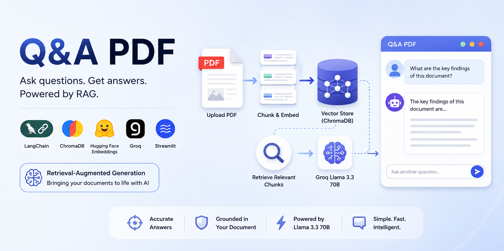

# 📄 Q&A PDF - Retrieval-Augmented Generation (RAG) Application

A simple Retrieval-Augmented Generation (RAG) application built with **Streamlit**, **LangChain**, **ChromaDB**, **Hugging Face Embeddings**, and **Groq Llama 3.3 70B**.

This application allows users to upload a PDF document, automatically create a vector database from its contents, and ask natural language questions about the document.

---

## 🚀 Features

- Upload PDF documents through a web interface
- Extract and chunk document content
- Generate embeddings using Hugging Face models
- Store embeddings in a persistent Chroma vector database
- Retrieve relevant document chunks using semantic search
- Generate context-aware answers using Groq's Llama 3.3 70B model
- Simple and intuitive Streamlit UI

---

## 🏗️ Architecture

```text
PDF Document
      │
      ▼
UnstructuredPDFLoader
      │
      ▼
Text Chunking
(RecursiveCharacterTextSplitter)
      │
      ▼
HuggingFace Embeddings
      │
      ▼
Chroma Vector Database
      │
      ▼
Retriever (Top K Chunks)
      │
      ▼
Prompt Template
      │
      ▼
Groq Llama 3.3 70B
      │
      ▼
Generated Answer
```

---

## 📂 Project Structure

```text
project/
│
├── app.py
├── rag_utility.py
├── .env
├── requirements.txt
├── doc_vectorstore/
└── README.md
```

---

## ⚙️ Technologies Used

- Python
- Streamlit
- LangChain
- ChromaDB
- Hugging Face Embeddings
- Groq API
- UnstructuredPDFLoader

---

## 🔑 Environment Variables

Create a `.env` file in the project root directory:

```env
GROQ_API_KEY=your_groq_api_key
```

---

## 📦 Installation

### 1. Clone the Repository

```bash
git clone https://github.com/yourusername/pdf-rag-app.git
cd pdf-rag-app
```

### 2. Create Virtual Environment

```bash
python -m venv venv
```

Activate the environment:

**Windows**

```bash
venv\Scripts\activate
```

**Linux / macOS**

```bash
source venv/bin/activate
```

### 3. Install Dependencies

```bash
pip install -r requirements.txt
```

---

## ▶️ Running the Application

Start the Streamlit application:

```bash
streamlit run app.py
```

The application will open in your browser.

---

## 📖 How It Works

### Document Processing

1. User uploads a PDF document.
2. The PDF is loaded using `UnstructuredPDFLoader`.
3. Text is split into chunks:
   - Chunk Size: 2000
   - Chunk Overlap: 200
4. Chunks are converted into embeddings.
5. Embeddings are stored in a persistent Chroma vector database.

### Question Answering

1. User submits a question.
2. Chroma retrieves the 3 most relevant chunks.
3. Retrieved context is injected into a prompt template.
4. Groq's Llama 3.3 70B model generates an answer.
5. The answer is displayed in the Streamlit interface.

---

## 🧠 Prompt Strategy

The application uses the following instruction:

> Use the provided context to answer the question as accurately as possible. If the answer is not available in the retrieved context, respond with:
>
> "I don't have enough information to answer that."

This helps reduce hallucinations and keeps responses grounded in the document.

---

## 🔍 Retrieval Configuration

| Parameter | Value |
|------------|--------|
| Chunk Size | 2000 |
| Chunk Overlap | 200 |
| Retriever K | 3 |
| Temperature | 0 |
| Vector Store | ChromaDB |
| LLM | Llama 3.3 70B Versatile |

---

## 📸 Application Workflow

```text
Upload PDF
    ↓
Process Document
    ↓
Create Embeddings
    ↓
Store in ChromaDB
    ↓
Ask Question
    ↓
Retrieve Relevant Chunks
    ↓
Generate Answer
    ↓
Display Response
```

---

## 🎯 Use Cases

- Research paper Q&A
- Company policy document assistant
- Contract review assistance
- Educational material exploration
- Technical documentation search
- Knowledge base chatbot

---

## 🚧 Future Improvements

- Multi-document support
- Chat history memory
- Source citations
- Document metadata filtering
- Hybrid search (keyword + vector)
- Streaming responses
- Support for DOCX, TXT, and HTML files
- User authentication

---

## 📄 License

This project is licensed under the MIT License.

---

## 👨‍💻 Author

Built using LangChain, ChromaDB, Hugging Face Embeddings, Groq Llama 3.3 70B, and Streamlit.
